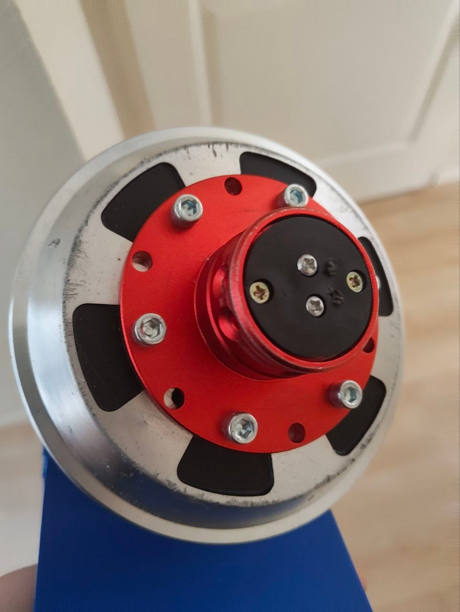
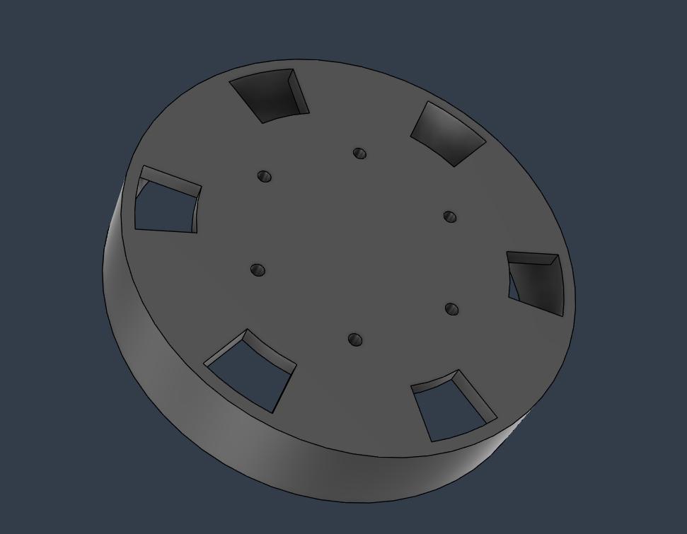

# Lucky_FFBeast_Drill_Guide
A drilling guide for 6.5" hover board wheels

When making my own DIY force feedback wheel, I noticed that the current drill guides that I found were not really fool-proof, I tried drilling first with a jig that sits inside the housing, onto the bearing, but I noticed a flaw.
This jig makes it so the distance between the guide and the object you're trying to drill through is quite large. This caused me to easily make a mistake whilst drilling.

So I made this simple yet effective drilling guide, that slides over the housing, ensuring minimal distance between the guide and the part.
I've added some holes after the fact to make positioning the guide easier to get more symmetric holes relative to the pattern on the wheel.    

